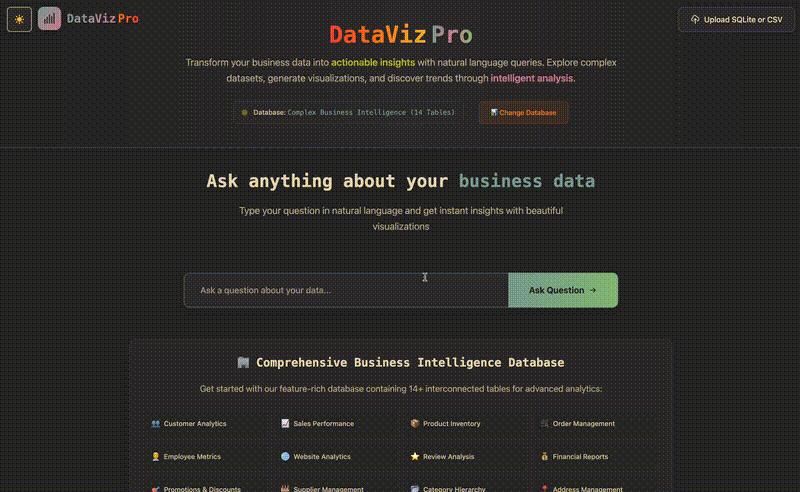

# Data Visualization with LangGraph

[](https://opensource.org/licenses/MIT)
[](https://www.python.org/downloads/)
[](https://nodejs.org/)

> Upload SQLite or CSV files, query data using natural language, and visualize results using AI-powered agents built with LangGraph.

## 🌟 Features

- **Natural Language Queries**: Ask questions about your data in plain English
- **File Upload Support**: Upload SQLite databases or CSV files (under 1MB)
- **AI-Powered SQL Generation**: Automatically generates SQL queries from natural language
- **Interactive Visualizations**: Creates charts, graphs, and plots based on query results
- **Real-time Streaming**: Watch the AI agent work through the problem step-by-step
- **Conversation History**: Keep track of previous queries and results
- **Multiple Backend Options**: Choose between Python or TypeScript backends
- **LangGraph Integration**: Built with LangChain's LangGraph for robust agent workflows

## 🎬 Demo

Watch the application in action:



> See how easy it is to upload data, ask natural language questions, and get beautiful visualizations powered by AI agents.

## 🏗️ Architecture

The application consists of several microservices:

1. **Frontend** (Next.js): User interface for uploading files and querying data
2. **SQLite Server** (Node.js): Handles file uploads and database operations
3. **LangGraph Backend** (Python/TypeScript): AI agent for query processing and visualization
4. **Conversation API** (Python): Manages conversation history and sessions

### Agent Workflow

The LangGraph agent is made up of several nodes that work together:

1. **Parse Question**: Analyzes user questions and database schema to identify relevant tables and columns
2. **Get Unique Nouns**: Extracts sample values from non-numeric columns for precise SQL generation
3. **Generate SQL**: Creates SQL queries based on the question and database context
4. **Validate and Fix SQL**: Ensures SQL syntax is correct and references valid schema elements
5. **Execute SQL**: Runs the validated query against the database
6. **Choose Visualization**: Selects appropriate chart type (bar, line, pie, scatter, etc.)
7. **Format Results**: Converts query results into human-readable responses
8. **Format Data for Visualization**: Prepares data for frontend rendering

## 🚀 Quick Start

### Prerequisites

- **Node.js 20+** and **Yarn**
- **Python 3.11+** and **pip**
- **LangGraph Studio** (recommended) or **LangGraph CLI**
- API keys for OpenAI or Google Gemini

### 1. Clone the Repository

```bash
git clone https://github.com/yourusername/datavisualization_langgraph.git
cd datavisualization_langgraph
```

### 2. Environment Setup

Use the provided script to set up environment files:

```bash
./manage_services.sh setup
```

This will create environment files from templates. Then edit them with your API keys:

**Frontend (`frontend/.env.local`):**

```env
NEXT_PUBLIC_APP_NAME=Data Visualization with LangGraph
NEXT_PUBLIC_SQLITE_URL=http://localhost:3001
LANGGRAPH_API_URL=http://localhost:8123
LANGSMITH_API_KEY=your_langsmith_api_key_here
```

**Python Backend (`backend_py/.env`):**

```env
# Choose one LLM provider
OPENAI_API_KEY=your_openai_api_key_here
# OR
GOOGLE_API_KEY=your_google_api_key_here

DB_ENDPOINT_URL=http://host.docker.internal:3001
PORT=5001
LANGSMITH_API_KEY=your_langsmith_api_key_here
```

### 3. Start All Services

Use the service management script to start everything:

```bash
./manage_services.sh start
```

This will automatically:

- Install all dependencies
- Start the SQLite server (port 3001)
- Start the conversation API (port 5001)
- Start the frontend (port 3000)

### 4. Start LangGraph Backend

#### Option A: Using LangGraph Studio (Recommended)

1. Download and install [LangGraph Studio](https://github.com/langchain-ai/langgraph-studio)
2. Open the `backend_py/my_agent` folder as a project in LangGraph Studio
3. The LangGraph API URL will be shown in the Studio interface
4. Update `LANGGRAPH_API_URL` in your frontend `.env.local` file

#### Option B: Using LangGraph CLI

```bash
cd backend_py
pip install langgraph-cli
langgraph dev
```

### 5. Access the Application

- **Frontend**: <http://localhost:3000>
- **SQLite Server**: <http://localhost:3001>
- **Conversation API**: <http://localhost:5001>
- **LangGraph Studio**: Check the Studio interface for the API URL

## 🛠️ Service Management

The `manage_services.sh` script provides comprehensive service management:

```bash
# Start all services
./manage_services.sh start

# Stop all services
./manage_services.sh stop

# Check service status
./manage_services.sh status

# View logs
./manage_services.sh logs

# Run health checks
./manage_services.sh health

# Restart all services
./manage_services.sh restart
```

### Individual Service Commands

```bash
# Start individual services
./manage_services.sh start-frontend
./manage_services.sh start-sqlite
./manage_services.sh start-api

# Stop individual services
./manage_services.sh stop-frontend
./manage_services.sh stop-sqlite
./manage_services.sh stop-api
```

## 📊 Usage

### 1. Upload Data

- Navigate to <http://localhost:3000>
- Upload a SQLite database or CSV file (under 1MB)
- Or use the default sample dataset

### 2. Ask Questions

Enter natural language questions about your data:

- "What are the top 5 products by revenue?"
- "Show me sales trends over time"
- "How many customers are from each region?"

### 3. View Results

- Watch the AI agent process your question step-by-step
- See the generated SQL query
- View the interactive visualization
- Explore conversation history

## 🔧 Development

### Project Structure

```file tree
datavisualization_langgraph/
├── frontend/                 # Next.js frontend application
├── backend_py/              # Python LangGraph backend
├── backend_js/              # TypeScript LangGraph backend (alternative)
├── sqlite_server/           # SQLite file server
├── manage_services.sh       # Service management script
├── .gitignore              # Git ignore rules
└── env.example             # Environment template
```

### Backend Options

Choose between Python or TypeScript backends:

- **Python Backend** (`backend_py/`): Uses Google Gemini or OpenAI
- **TypeScript Backend** (`backend_js/`): Uses OpenAI

Both backends provide the same functionality. The Python backend is recommended for better LangGraph integration.

### Adding New Visualizations

1. Create a new component in `frontend/src/components/graphs/`
2. Add the component to `graphDictionary.ts`
3. Update the backend's `DataFormatter` to support the new visualization type

### Environment Variables

| Variable | Description | Required |
|----------|-------------|----------|
| `OPENAI_API_KEY` | OpenAI API key | Yes (if using OpenAI) |
| `GOOGLE_API_KEY` | Google Gemini API key | Yes (if using Google) |
| `LANGSMITH_API_KEY` | LangSmith API key for tracing | Optional |
| `LANGGRAPH_API_URL` | LangGraph backend URL | Yes |
| `NEXT_PUBLIC_SQLITE_URL` | SQLite server URL | Yes |
| `DB_ENDPOINT_URL` | Database endpoint for backend | Yes |

## 🤝 Contributing

1. Fork the repository
2. Create a feature branch (`git checkout -b feature/amazing-feature`)
3. Commit your changes (`git commit -m 'Add amazing feature'`)
4. Push to the branch (`git push origin feature/amazing-feature`)
5. Open a Pull Request

### Development Guidelines

- Follow the existing code style and conventions
- Add tests for new features
- Update documentation as needed
- Ensure all services pass health checks

## 🐛 Troubleshooting

### Common Issues

**Services won't start:**

```bash
# Check if ports are already in use
./manage_services.sh status

# Clean up and restart
./manage_services.sh stop
./manage_services.sh clean
./manage_services.sh start
```

**Environment issues:**

```bash
# Reconfigure environment files
./manage_services.sh setup
# Edit the .env files with your API keys
```

**LangGraph connection issues:**

- Ensure LangGraph Studio is running
- Check the `LANGGRAPH_API_URL` in frontend `.env.local`
- Verify API keys are correctly set

**Database upload issues:**

- File size must be under 1MB
- Supported formats: SQLite (.sqlite, .db) and CSV (.csv)
- Check SQLite server logs: `./manage_services.sh logs`

### Health Monitoring

```bash
# Check all services
./manage_services.sh health

# View detailed logs
./manage_services.sh logs

# Monitor individual service status
./manage_services.sh status
```

## 📝 License

This project is licensed under the MIT License - see the [LICENSE](LICENSE) file for details.

## 🙏 Acknowledgments

- [LangChain](https://langchain.com/) for the amazing LangGraph framework
- [Next.js](https://nextjs.org/) for the frontend framework
- [MUI](https://mui.com/) for the beautiful UI components
- [SQLite](https://sqlite.org/) for the embedded database

## 📞 Support

If you encounter any issues or have questions:

1. Check the [troubleshooting section](#-troubleshooting)
2. Look through existing [GitHub Issues](https://github.com/yourusername/datavisualization_langgraph/issues)
3. Create a new issue with detailed information about your problem

---

Made with ❤️ using LangGraph and Next.js
